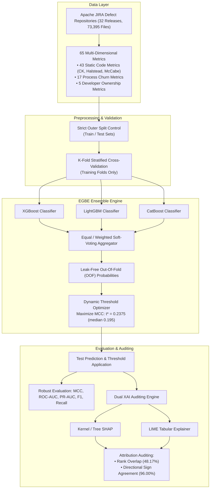

# EGBE: An Explainable Gradient Boosting Ensemble for Software Defect Prediction

[](https://www.python.org/downloads/)
[](https://opensource.org/licenses/MIT)
[](https://www.kaggle.com/datasets/efrathhossainshihab/jira-defect-datasets-full)
[](https://xgboost.readthedocs.io/)
[](https://lightgbm.readthedocs.io/)
[](https://catboost.ai/)
[](https://github.com/shap/shap)

> **Official Implementation & Replication Package**  
> Research Paper: *"EGBE: An Explainable Gradient Boosting Ensemble for Software Defect Prediction"*  
> Evaluated on **73,395 file-level modules** across **32 releases** of **9 open-source Apache software repositories** with **65 multi-dimensional software metrics**.

---

## 📑 Table of Contents
- [📌 Abstract & Overview](#-abstract--overview)
- [🏗 System Architecture](#-system-architecture)
- [📊 Key Experimental Results](#-key-experimental-results)
  - [1. Within-Project Defect Prediction (WPDP)](#1-within-project-defect-prediction-wpdp)
  - [2. Out-of-Fold Threshold Optimization](#2-out-of-fold-threshold-optimization)
  - [3. Dual XAI Auditing (SHAP vs. LIME)](#3-dual-xai-auditing-shap-vs-lime)
  - [4. Cross-Project & Domain Adaptation](#4-cross-project--domain-adaptation)
- [📂 Repository Structure](#-repository-structure)
- [🚀 Quick Start & Installation](#-quick-start--installation)
- [💻 Modular API Usage](#-modular-api-usage)
- [📦 Dataset Details](#-dataset-details)
- [👥 Authors & Affiliations](#-authors--affiliations)
- [📜 Citation](#-citation)
- [📄 License](#-license)

---

## 📌 Abstract & Overview
Software Defect Prediction (SDP) empowers Software Quality Assurance (SQA) teams to optimize code review and testing effort by proactively detecting defect-prone software components. However, widespread deployment in CI/CD pipelines faces major operational bottlenecks:
- **Severe Class Imbalance:** Defective modules typically account for only 2% to 18% of released files (~9.78% benchmark average), making default classification thresholds suboptimal.
- **Data Leakage in Optimization:** Traditional threshold search on validation or test sets leaks target labels.
- **Concept Drift & Distribution Shifts:** Temporal software evolution (Cross-Release) and architectural divergences (Cross-Project) degrade classifier efficacy.
- **Opaque Black-Box Predictions:** Practitioners lack confidence in unverified explainability models.

**EGBE** overcomes these hurdles via an integrated end-to-end framework:
1. **Multi-Model Soft-Voting Ensemble:** Combines Extreme Gradient Boosting (**XGBoost**), Light Gradient Boosting Machine (**LightGBM**), and Categorical Boosting (**CatBoost**) for optimal probability calibration.
2. **Leak-Free Out-Of-Fold (OOF) Decision Threshold Optimization:** Calibrates decision cutoffs dynamically using training-side cross-validation predictions to maximize Matthews Correlation Coefficient (MCC) without test-set leakage.
3. **Dual-Perspective XAI Auditing:** Evaluates both **SHAP** and **LIME** attributions across 32 software releases, establishing rigorous metrics for local rank overlap and directional sign agreement.

---

## 🏗 System Architecture



---

## 📊 Key Experimental Results

### 1. Within-Project Defect Prediction (WPDP)
Mean performance across **32 software releases** evaluated with calibrated out-of-fold thresholding:

| Model Architecture | Accuracy | Precision | Recall | F1-Score | **MCC** | Balanced Acc. | **ROC-AUC** | **PR-AUC** |
|:---|:---:|:---:|:---:|:---:|:---:|:---:|:---:|:---:|
| **XGBoost** | 0.8851 | 0.5164 | 0.5064 | 0.4930 | 0.4350 | 0.7169 | 0.8562 | 0.5258 |
| **LightGBM** | 0.8841 | 0.4994 | 0.5078 | 0.4911 | 0.4296 | 0.7162 | 0.8566 | 0.5317 |
| **CatBoost** | **0.8900** | **0.5339** | **0.5290** | **0.5111** | **0.4566** | **0.7291** | 0.8569 | 0.5373 |
| **EGBE-Equal** (Ours) | 0.8882 | 0.5151 | 0.5223 | 0.5068 | 0.4469 | 0.7259 | **0.8626** | **0.5435** |
| **EGBE-Weighted** (Ours) | 0.8882 | 0.5098 | 0.5128 | 0.5013 | 0.4402 | 0.7213 | 0.8623 | 0.5375 |
| **EGBE-Stacked** (Ours) | 0.8872 | 0.5084 | 0.5218 | 0.5004 | 0.4416 | 0.7247 | 0.8613 | 0.5400 |

> **Takeaway:** While CatBoost achieves the highest observed mean MCC (0.4566), **EGBE-Equal provides superior probability ranking discrimination** with the highest benchmark ROC-AUC (0.8626) and PR-AUC (0.5435).

---

### 2. Out-of-Fold Threshold Optimization
Comparing standard default decision boundary (`0.50`) against EGBE's training-side leak-free OOF threshold ($t^*$):

| Metric | Default Boundary ($t = 0.50$) | OOF-Optimized ($t = t^*$) | Delta ($\Delta$) | Statistical Significance |
|:---|:---:|:---:|:---:|:---:|
| **Defect Recall** | 34.36% | **54.39%** | **+20.03%** | $p < 0.001$ |
| **MCC** | 0.4118 | **0.4592** | **+0.0473** | $p = 0.0034$ |
| **F1-Score** | 0.4247 | **0.5161** | **+0.0914** | $p < 0.001$ |
| **Balanced Accuracy** | 0.6575 | **0.7371** | **+0.0796** | $p < 0.001$ |
| **Precision** | **66.12%** | 51.73% | -14.39% | - |
| **ROC-AUC** | 0.8636 | 0.8636 | 0.0000 | Threshold-invariant |
| **PR-AUC** | 0.5465 | 0.5465 | 0.0000 | Threshold-invariant |

> **Key Takeaway:** Static 0.50 cutoffs fail in imbalanced defect prediction, missing two-thirds of defective modules. Dynamic OOF optimization ($t^* \approx 0.2375$) rescues **+20.03% of defective files** without any test-label leakage.

---

### 3. Dual XAI Auditing (SHAP vs. LIME)
Audit of 104 paired local explanations across releases:
- **Top-10 Local Rank Overlap:** `48.17%` (Moderate overlap reflecting differences between linear surrogate approximation and Shapley cooperative game theory).
- **Directional Sign Agreement:** **`96.00%`** (Near-perfect agreement on whether a feature positively elevates or negatively reduces defect risk).
- **Seed Perturbation Stability:** **`98.13%`** sign consistency across random perturbations.
- **Top Global Drivers:** Process volatility (`Added_lines`, `COMM`, `Del_lines`, `Churn`) acts as an immediate risk catalyst, while static code complexity metrics comprise `70.45%` of aggregate background structural vulnerability.

---

### 4. Cross-Project & Domain Adaptation
- **Direct Cross-Project Transfer (CPDP):** Achieves viable baseline (Mean MCC = `0.3351`, Balanced Accuracy = `0.6965`).
- **Unsupervised Domain Adaptation Failure:**
  - **CORAL** degrades MCC to `0.2945` ($-0.0406$) due to linear covariance distortion of tree partition boundaries.
  - **NNFilter** degrades MCC to `0.3132` ($-0.0219$) due to nearest-neighbor instance pruning disrupting non-linear interactions.
- **Recommendation:** In operational zero-label cross-project deployments, direct ensemble transfer is more dependable than heuristic distribution warping.

---

## 📂 Repository Structure

```text
egbe-software-defect-prediction/
│
├── paper/
│   ├── main.tex                                       # Full IEEEtran LaTeX source code
│   ├── references.bib                                 # Complete BibTeX bibliography
│   └── figures/                                       # Vector diagrams and paper figures
│
├── notebooks/
│   └── egbe-an-explainable-gradient-boosting-ensemble.ipynb  # Comprehensive Kaggle/local notebook
│
├── results/
│   ├── tables/                                        # Generated Excel & CSV comparison tables
│   ├── figures/                                       # Confusion matrices, ROC/PR, and XAI plots
│   └── metrics/                                       # Checkpointed protocol evaluation metrics
│
├── src/
│   ├── preprocessing/                                 # Data ingestion and chronological splitting
│   │   ├── __init__.py
│   │   └── data_loader.py
│   ├── feature_selection/                             # 65-metric ablation & selection
│   │   ├── __init__.py
│   │   └── selector.py
│   ├── models/                                        # EGBE soft-voting ensemble & threshold tuner
│   │   ├── __init__.py
│   │   ├── egbe_ensemble.py
│   │   └── threshold_optimizer.py
│   ├── xai/                                           # Dual SHAP & LIME auditing framework
│   │   ├── __init__.py
│   │   └── audit_agreement.py
│   └── evaluation/                                    # Performance metrics & domain adaptation
│       ├── __init__.py
│       ├── metrics.py
│       └── domain_adaptation.py
│
├── data/
│   └── README.md                                      # Dataset documentation & download links
│
├── README.md                                          # Master repository documentation
├── requirements.txt                                   # Python package dependencies
└── .gitignore                                         # Build artifact & cache exclusion rules
```

---

## 🚀 Quick Start & Installation

### 1. Clone & Set Up Environment
```bash
# Clone repository
git clone https://github.com/efrathshihab/egbe-software-defect-prediction.git
cd egbe-software-defect-prediction

# Create isolated Python virtual environment
python3 -m venv venv
source venv/bin/activate       # On Windows: venv\Scripts\activate

# Install required dependencies
pip install --upgrade pip
pip install -r requirements.txt
```

### 2. Download Dataset
Curated CSV files for all 32 releases can be acquired from Kaggle:
- **Kaggle Dataset:** [JIRA Defect Datasets Full](https://www.kaggle.com/datasets/efrathhossainshihab/jira-defect-datasets-full)

Place the downloaded CSV files directly into the `data/` directory.

### 3. Run Experiments
Execute the complete end-to-end experimental pipeline in Jupyter:
```bash
jupyter lab notebooks/egbe-an-explainable-gradient-boosting-ensemble.ipynb
```

---

## 💻 Modular API Usage

The modules in `src/` can be easily incorporated into custom Python workflows:

```python
import pandas as pd
from src.preprocessing.data_loader import load_project_dataset
from src.models.egbe_ensemble import EGBEEnsemble
from src.evaluation.metrics import evaluate_predictions
from src.xai.audit_agreement import calculate_rank_overlap, calculate_sign_agreement

# 1. Load an Apache software release dataset
X, y, feature_names = load_project_dataset("data/camel-1.4.0_clean.csv")

# 2. Instantiate and train EGBE with Out-of-Fold (OOF) threshold optimization
egbe = EGBEEnsemble(voting="equal", random_state=42)
egbe.fit(X, y, optimize_oof_threshold=True, n_splits=5)

print(f"Optimal decision threshold t*: {egbe.optimal_threshold_:.4f}")

# 3. Predict defect probabilities and calibrated binary labels
probs = egbe.predict_proba(X)[:, 1]
preds = egbe.predict(X)

# 4. Evaluate defect prediction performance
scores = evaluate_predictions(y, preds, probs)
print(f"MCC: {scores['MCC']:.4f} | Recall: {scores['Recall']:.4f} | PR-AUC: {scores['PR_AUC']:.4f}")
```

---

## 📦 Dataset Details

The empirical evaluation utilizes 73,395 file-level modules from 9 mature Apache software systems across 32 chronological releases:

| Project | Domain | Evaluated Releases | Total Files | Defective Files | Defect Rate (%) |
|:---|:---|:---:|:---:|:---:|:---:|
| **ActiveMQ** | Message Broker | 5.0.0, 5.1.0, 5.2.0, 5.3.0, 5.8.0 | 9,385 | 1,180 | 12.57% |
| **Camel** | Integration Framework | 1.4.0, 2.9.0, 2.10.0, 2.11.0 | 25,650 | 1,452 | 5.66% |
| **Derby** | Relational Database | 10.2.1.6, 10.3.1.4, 10.5.1.1 | 6,707 | 1,516 | 22.60% |
| **Groovy** | Programming Language | 1.5.7, 1.6-BETA-1, 1.6-BETA-2 | 2,437 | 256 | 10.50% |
| **HBase** | Distributed NoSQL Store | 0.94.0, 0.95.0, 0.95.2 | 4,286 | 660 | 15.40% |
| **Hive** | Data Warehouse System | 0.9.0, 0.10.0, 0.12.0 | 4,749 | 499 | 10.51% |
| **JRuby** | Ruby Language Implementation | 1.1, 1.4.0, 1.5.0, 1.7.0.preview1 | 4,491 | 487 | 10.84% |
| **Lucene** | Search Engine Library | 2.3.0, 2.9.0, 3.0.0, 3.1 | 7,651 | 868 | 11.34% |
| **Wicket** | Component Web Framework | 1.3.0-beta1, 1.3.0-beta2, 1.5.3 | 8,039 | 262 | 3.26% |
| **Total / Overall** | **9 Software Domains** | **32 Releases** | **73,395** | **7,180** | **9.78%** |

Refer to [data/README.md](data/README.md) for full descriptions of all 65 structural, churn, and ownership metrics.

---

## 👥 Authors & Affiliations

| Author | Department & Affiliation | Email | Role |
|:---|:---|:---:|:---:|
| **Efrath Hossain Shihab** | Dept. of Computer Science and Engineering<br>American International University-Bangladesh (AIUB) | `22-47592-2@student.aiub.edu` | First Author |
| **Jannatul Ferdousi Nisa** | Dept. of Computer Science and Engineering<br>American International University-Bangladesh (AIUB) | `22-48041-2@student.aiub.edu` | Co-Author |
| **Md. Abdul Ahad** | Dept. of Computer Science and Engineering<br>American International University-Bangladesh (AIUB) | `22-49726-3@student.aiub.edu` | Co-Author |
| **S M Abdullah Shafi** | Dept. of Computer Science<br>American International University-Bangladesh (AIUB) | `shafi@aiub.edu` | Corresponding Author (*) |

---

## 📜 Citation

If you utilize EGBE or our benchmark artifacts in your research, please cite our publication:

```bibtex
@inproceedings{shihab2025egbe,
  author    = {Shihab, Efrath Hossain and Nisa, Jannatul Ferdousi and Ahad, Md. Abdul and Shafi, S M Abdullah},
  title     = {EGBE: An Explainable Gradient Boosting Ensemble for Software Defect Prediction},
  year      = {2025}
}
```

---

## 📄 License
This project is open-sourced under the [MIT License](LICENSE).
